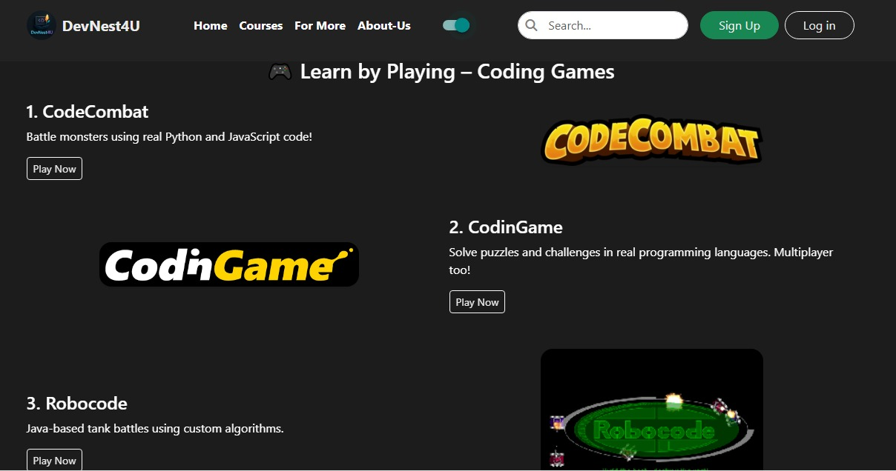
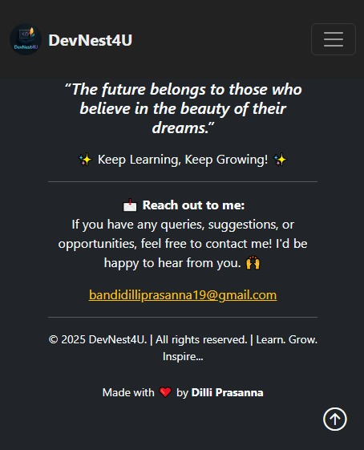

# 🚀 DevNest4U - Learn. Code. Evolve. Repeat.

Welcome to **DevNest4U**, an all-in-one educational platform designed for beginners and developers looking to level up in **Web Development**, **Python**, **UI/UX Design**, **API Integration**, and much more!

## 🌐 Live Website
Check it out here 👉 [devnest4u.netlify.app](https://devnest4u.netlify.app)

## 📌 Project Overview

**DevNest4U** is a multi-page responsive website built to provide:
- ✅ Curated Free Learning Resources
- 🎮 Coding Games to Learn While Playing
- 🗺️ Interactive Roadmaps
- 📄 Downloadable Docs & Notes
- 🧠 Beginner to Advanced Course Links
- 🔐 Firebase Authentication
- 📱 Fully Mobile-Responsive Layout

## 🛠️ Built With

- **Frontend:** HTML5, CSS3, JavaScript, Bootstrap 5
- **Authentication:** Firebase Auth
- **Hosting:** Netlify
- **Design Tools:** Canva, Figma

## 📚 Learning & Skills Gained

- Frontend Development (HTML/CSS/JS/Bootstrap)
- Firebase Authentication (User Login/Sign-up)
- Responsive Web Design & Layout Planning
- Hosting & Deployment using Netlify
- UX Writing & User Navigation Design
- Using AI Tools for Web Dev Speed-up

## 📷 Screenshots

| Homepage | Course Section | Python Page |
|---------|----------------|-------------|
| |  |  |  |

## 📂 How to Use

```bash
# Clone this repository
git clone https://github.com/DilliPrasanna2244/DevNest4U__ResponsiveWebsite.git

# Open in browser
Open index.html in your preferred browser.


📬 Feedback & Suggestions
I’m always open to improving this platform! Feel free to fork, clone, or drop your ideas in the Issues tab. Let's build and learn together.

🙌 Acknowledgements
Thanks to all open-source platforms, APIs, and course creators for contributing to the learning community. ❤️

“Code. Learn. Evolve. Repeat.”
Share this with friends or peers who are beginning their web development journey!


📌 Connect with me on www.linkedin.com/in/dilliprasannabandi | 🌟 Star the repo if you liked it!
